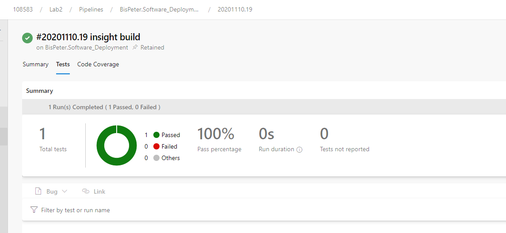
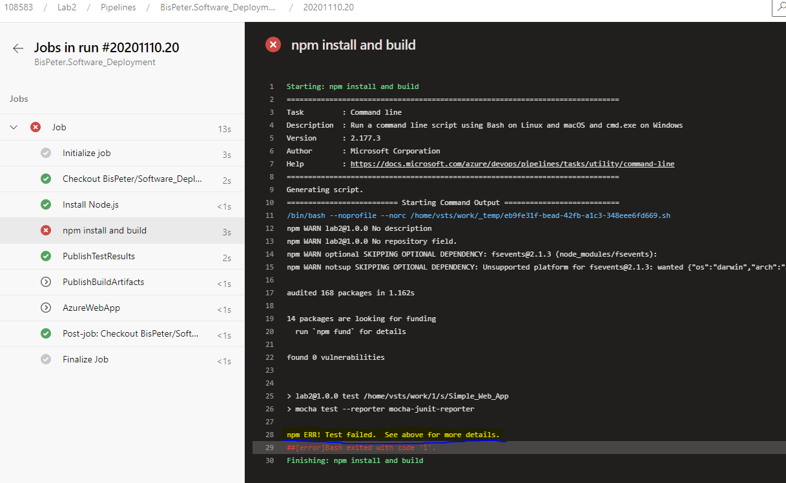
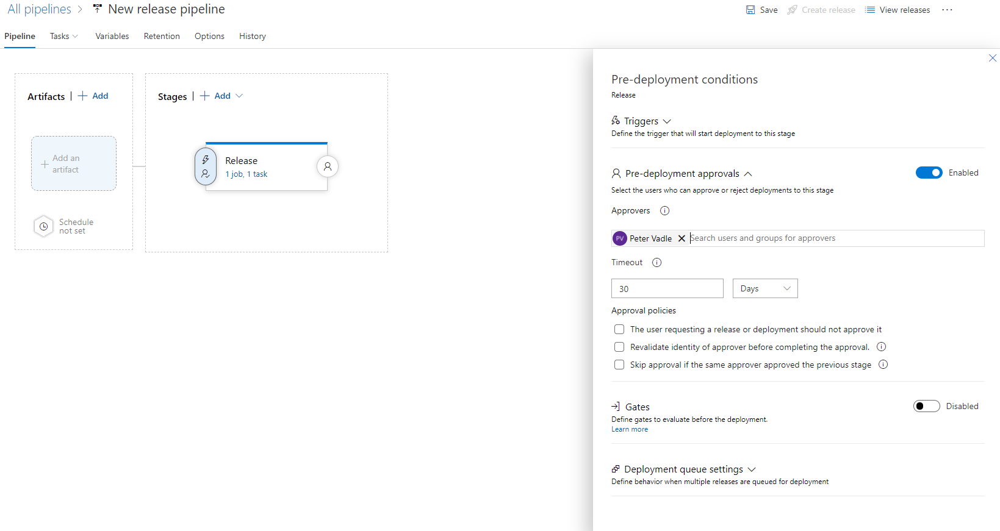
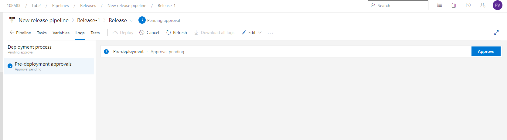
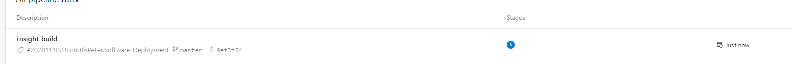
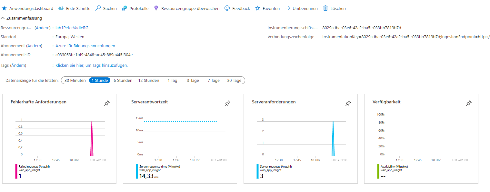
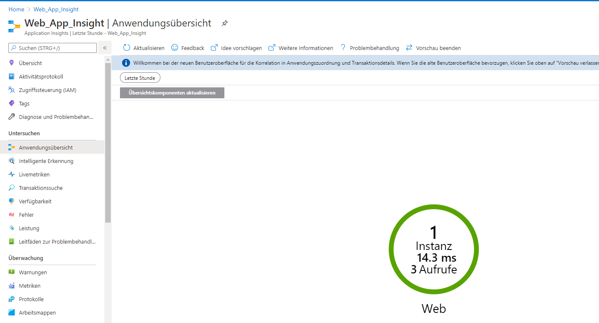

# Doku zu Lab 2
### Git Repo: https://github.com/BisPeter/Software_Deployment/tree/master/Simple_Web_App
### Development Webseite: https://lab1petervadle.azurewebsites.net/
### Release Website: https://lab2releasewebapp.azurewebsites.net
## Screenshot von Build,Test,Deploy Pipeline

## Screenshot von erfolgreichem Test

## Auf diesem Screenshot sieht man einen fehgeschlagenen Test. Hier war das Deployment nicht erfolgreich.

## Es wird hier eine neue Release Pipeline erstellt, so dass das Deployment bestätigt werden muss.

## Screenshot von dem Bestätigungsaufruf für das Deployen.

## Screenshot von einem erfolgreichen Deployment.

## Screenshot von einem Beispiel für das automatische Deployen.

## Als letzten Schritt habe ich die Applikationsinsights zum Projekt dazugegeben.

