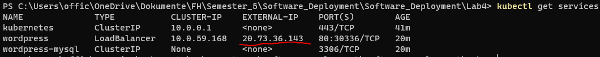

# Doku Lab4

## Seiten URL

Die seit ist gehost af die folgende Adresse:
```
http://20.73.36.143
```

### Azure Kubernetes Service

Als erstes öffnen vom PowerShell.

Man muss sich beim Azure anmelden mit dem folgenden command: 
```
az login
```

Es muss ein Kubernetes service erstellt werden: 
```
az aks create -g Peter_V_Lab4_RG -n AKService --node-count 1 --generate-ssh-keys
```

Es müssen die credentials heruntergeladet werden: 
```
az aks get-credentials --resource-group Peter_V_Lab4_RG --name AKService
```

Danach muss ein passwort erstellt werden: 
```
kubectl create secret generic mysql-pass --from-literal=password=123456789
```


Man muss sich am azure portal ein bash fenster starten und die folgende commands eingeben.

```
az account set --subscription 'Abonnement-ID'
```

```
az aks get-credentials --resource-group Peter_V_Lab4 --name AKService
``` 


Wir müssen zwei yaml files erstellen die danach hochgeladen werden.
 ```
'mysql-deployment.yaml'
```
und
```
'wordpress-deployment.yaml'
```

Jetzt müssem wir die erstelle yaml files hochladedn. 
```
kubectl apply -f .\mysql-deployment.yaml
```

und 

```
kubectl apply -f .\wordpress-deployment.yaml
```
 to the Azure storage and execute these two commands to apply both ".yaml" files:


Mit dem folgenden befehl erhalten wir die laufende services

```
kubectl get services
```

Mit dem EXTERNAL-IP können wir nun die seite afurufen.